# Legacy Claims Service — End-to-End Analysis

_Generated: 2026-08-23_

---

## 1. Purpose

`legacy-claims-service` is an insurance claims processing microservice for Infy Claims. It exposes a small REST API (`/claims`) that accepts a `Claim` payload, validates it, checks policy/customer eligibility (waiting periods, sum-insured caps, product-specific exclusions for HEALTH / MOTOR / LIFE), computes a heuristic fraud score, recalculates the policy premium, computes a payout (applying co-pay, motor depreciation, deductible, and sum-insured caps), and persists the outcome. It is a hybrid architecture: a Spring Boot 2.3 / Java 8 web layer sits in front of an Oracle database whose stored procedures (`SP_CALCULATE_PREMIUM`, `SP_VALIDATE_CLAIM`, `SP_FRAUD_SCORE`, `SP_MOTOR_DEPRECIATION`) still own significant business logic. A 2018 refactor (CLM-1704) moved parts of the premium / fraud / eligibility rules into `ClaimService`, but the stored procs were never retired — they are still invoked by nightly batch jobs, and in several cases the Java and PL/SQL rules have drifted out of sync.

---

## 2. Component relationships

```mermaid
graph TD
    subgraph Client
        HTTP[HTTP client / partner]
    end

    subgraph Web["Web layer"]
        CC["ClaimController<br/>(/claims)"]
        SEC["SecurityConfig<br/>(in-memory basic auth)"]
    end

    subgraph Service["Service layer"]
        CS["ClaimService"]
    end

    subgraph Data["Data access layer"]
        DAO["ClaimDAO"]
    end

    subgraph Models["Model classes (crossing boundaries)"]
        MC[Claim]
        MP[Policy]
        MCU[Customer]
        MFS[FraudScore]
    end

    subgraph DB["Oracle DB"]
        T_CLAIMS[(CLAIMS)]
        T_POL[(POLICIES)]
        T_CUST[(CUSTOMERS)]
        T_MPD[(MOTOR_POLICY_DETAILS)]
        T_LIFE[(CUSTOMER_LIFESTYLE)]
        T_GRP[(POLICY_GROUP_MAP)]
        T_RISK[(RISK_STATES)]
        T_BL[(PROVIDER_BLACKLIST)]
        T_EMP[(EMPANELLED_HOSPITALS)]
        T_GEO[(GEO_EXCLUSIONS)]
        T_AUDIT[(PREMIUM_AUDIT / CLAIM_FRAUD_LOG)]

        SP1[[SP_CALCULATE_PREMIUM]]
        SP2[[SP_VALIDATE_CLAIM]]
        SP3[[SP_FRAUD_SCORE]]
        SP4[[SP_MOTOR_DEPRECIATION]]
    end

    subgraph Dead["Dead / unused components"]
        LX[LegacyXmlParser]
        PU[PaymentUtil]
        LF["/claims/legacy-format endpoint"]
        BI["/claims/batch-import endpoint"]
        GCL["ClaimService.getClaimHistoryLegacy()"]
        FCC["ClaimDAO.findClaimsByCustomerAndYear()"]
        DSC["ClaimDAO.saveClaim(String,Claim) - debug overload"]
    end

    HTTP --> CC
    SEC -. enforces .-> CC
    CC --> CS
    CS --> DAO

    DAO --> T_CLAIMS
    DAO --> T_POL
    DAO --> T_CUST
    DAO --> SP4
    SP4 --> T_MPD

    CS -.-> MC
    CS -.-> MP
    CS -.-> MCU
    CS -.-> MFS
    CC -.-> MC
    CC -.-> MFS
    DAO -.-> MC
    DAO -.-> MP
    DAO -.-> MCU

    %% Stored procs still referenced but not called from Java runtime
    SP1 -. wired but never called from Java .-> T_POL
    SP1 --> T_LIFE
    SP1 --> T_GRP
    SP1 --> T_RISK
    SP1 --> T_AUDIT
    SP2 -. only nightly batch .-> T_BL
    SP2 -. only nightly batch .-> T_EMP
    SP2 -. only nightly batch .-> T_GEO
    SP2 -. only nightly batch .-> T_CLAIMS
    SP3 -. only nightly batch .-> T_CLAIMS
    SP3 -. only nightly batch .-> T_AUDIT

    %% Dead components (dashed)
    CC -.-> LF
    CC -.-> BI
    CS -.-> GCL
    GCL -.-> FCC
    CS -.-> DSC
    DAO -.-> LX
    DAO -.-> PU

    classDef dead stroke-dasharray: 5 5,stroke:#c33,color:#c33;
    class LX,PU,LF,BI,GCL,FCC,DSC dead;
```

**Java ↔ stored proc call matrix**

| Java caller | Stored proc | Actually invoked at runtime? |
|---|---|---|
| `ClaimDAO.fetchMotorDepreciation` | `SP_MOTOR_DEPRECIATION` | ✅ Yes — from `ClaimService.computePayout` for MOTOR policies |
| `ClaimDAO.init` (wires `spCalculatePremium`) | `SP_CALCULATE_PREMIUM` | ❌ No — `SimpleJdbcCall` is created but never `.execute()`d. Only fired by nightly batch `CLAIMS_NIGHTLY_RECALC.SQL` |
| _(none)_ | `SP_VALIDATE_CLAIM` | ❌ No Java call path. Only `NIGHTLY_CLAIM_SWEEP` |
| _(none)_ | `SP_FRAUD_SCORE` | ❌ No Java call path. Only `NIGHTLY_FRAUD_SWEEP` |

---

## 3. Hidden business rules

### 3.1 Rules in `ClaimService.java`

**Input validation — `submitClaim`** (`ClaimService.java:67-80`)
- `customerId` required.
- `policyNumber` required.
- `claimAmount` must be > 0.

**Eligibility — `checkEligibility`** (`ClaimService.java:157-230`)
- Policy end date in the past → `POLICY_EXPIRED`.
- Policy start date in the future → `POLICY_NOT_STARTED`.
- **HEALTH**:
  - 30-day general waiting period (accidents exempt) → `WITHIN_WAITING_PERIOD`.
  - Maternity: 270-day waiting period → `MATERNITY_WAITING_PERIOD`.
  - Maternity: gender must be `F` → `MATERNITY_NOT_APPLICABLE`.
  - Maternity: age must be 18–45 → `MATERNITY_AGE_OUT_OF_RANGE`.
  - Pre-existing disease: 4-year (1460-day) exclusion → `PED_EXCLUSION_PERIOD`.
- **MOTOR**:
  - Day-zero exclusion (same-day claim rejected) → `MOTOR_DAY_ZERO_EXCLUSION`.
  - Theft claim within 90 days of policy start → `THEFT_PROBATION_PERIOD`.
- **LIFE**:
  - Suicide claim within 365 days → `SUICIDE_EXCLUSION_PERIOD`.
- Sum-insured cap with 5% overshoot allowed for GOLD/PLATINUM loyalty tiers → else `EXCEEDS_SUM_INSURED`.

**Premium — `calculatePremium`** (`ClaimService.java:236-323`)
- Base = `sumInsured * 0.02`, default 5000 if null.
- Age band (HEALTH/LIFE only): <25 ×0.85, <40 ×1.0, <55 ×1.35, <65 ×1.75, <75 ×2.4, 75+ ×3.2.
- Senior HEALTH loading: additional ×1.15 for 65–74, ×1.25 for 75+.
- High-risk pincode prefix (`110/400/560/600/700`) ×1.12.
- Occupation: miner/pilot/diver ×1.5; driver/construction ×1.25; teacher/clerk/software ×0.95; defence/defense/army ×0.85.
- Loyalty: SILVER ×0.98; GOLD ×0.95; PLATINUM ×0.90.
- Prior claims history: 0 ×0.90; 1 ×1.0; 2 ×1.15; 3–5 ×1.35; 6+ ×1.60.
- Women's HEALTH discount ×0.97.
- Rounded to 2 decimals.

**Fraud score — `computeFraudScore`** (`ClaimService.java:328-399`)
- Amount > 2,000,000 → +30 `VERY_HIGH_VALUE`; else > 500,000 → +15 `HIGH_VALUE`.
- Submission hour 01:00–04:00 → +10 `ODD_HOUR_SUBMISSION`.
- Pincode prefix in `HIGH_RISK_PINCODES` → +15 `HIGH_RISK_REGION`.
- Surname in `WATCH_LIST_SURNAMES` (`kumar/sharma/singh`) → +20 `WATCH_LIST_NAME`.
- > 3 prior approved claims → +20 `MULTIPLE_RECENT_CLAIMS`.
- Claim within 30 days of policy start → +15 `EARLY_POLICY_CLAIM`.
- Bands: ≥60 HIGH, ≥30 MEDIUM, else LOW.
- Score > 80 in `submitClaim` short-circuits to `PENDING_REVIEW` (`ClaimService.java:107`).

**Payout — `computePayout`** (`ClaimService.java:404-434`)
- HEALTH + age > 60 → 20% co-pay (×0.80).
- MOTOR → subtract depreciation factor from `SP_MOTOR_DEPRECIATION`.
- Subtract `deductible` (floor at 0).
- Cap at `sumInsured`.
- Rounded to 2 decimals.

**Age default** (`ClaimService.java:436-439`)
- If `dob` is null, age defaults to **30** (affects both eligibility and pricing silently).

---

### 3.2 Rules in stored procs

**`SP_CALCULATE_PREMIUM`** (`db/stored-procs/SP_CALCULATE_PREMIUM.sql`)
- Base = `SUM_INSURED * 0.02`.
- Tobacco loading (from `CUSTOMER_LIFESTYLE.TOBACCO_FLAG`): HEALTH ×1.40, LIFE ×1.55.
- BMI loading (HEALTH only): BMI>35 ×1.30; BMI>30 ×1.15; BMI<18 ×1.10.
- Group discount (from `POLICY_GROUP_MAP`): size>500 ×0.70; >100 ×0.80; >25 ×0.90.
- War/terror/disturbed-region loading: multiply by each matching `RISK_STATES.LOADING_FACTOR` for the customer's 2-char state (pincode prefix).
- Writes to `PREMIUM_AUDIT` with `COMMIT`.

**`SP_VALIDATE_CLAIM`** (`db/stored-procs/SP_VALIDATE_CLAIM.sql`)
- KYC status ≠ `COMPLETE` → `CUSTOMER_KYC_INCOMPLETE`.
- Provider in `PROVIDER_BLACKLIST` (with active `END_DATE`) → `HOSPITAL_BLACKLISTED`.
- HEALTH claim on a non-empanelled hospital → `HOSPITAL_NOT_EMPANELLED`.
- Claim pincode in `GEO_EXCLUSIONS` (`DISASTER`/`OUT_OF_ZONE`/`REGULATORY`) → `GEO_EXCLUDED`.
- Duplicate detection: same customer + provider + amount within ±7 days → `DUPLICATE_CLAIM`.

**`SP_FRAUD_SCORE`** (`db/stored-procs/SP_FRAUD_SCORE.sql`)
- Amount > 2,000,000 → +**35** (Java uses +30); > 500,000 → +**18** (Java uses +15).
- Claim / sum-insured ratio > 0.9 → +20; > 0.7 → +10.
- Submission hour 01:00–04:00 → +10.
- Prior claims in last 6 months > 3 → +25; > 1 → +10 (Java uses "> 3 all-time approved" → +20).
- Bands identical to Java (≥60 HIGH, ≥30 MEDIUM).

**`SP_MOTOR_DEPRECIATION`** (`db/stored-procs/SP_MOTOR_DEPRECIATION.sql`)
- Age-based depreciation from `MOTOR_POLICY_DETAILS.REGISTRATION_DATE`: <1yr 5%, <2 15%, <3 25%, <4 35%, <5 40%, <10 50%, ≥10 60%.
- Commercial vehicles: +10% flat, capped at 70%.
- Vehicle not found → default 10%.

---

### 3.3 Rules in one place but not the other

> **These are the divergences the Java team likely doesn't know about.**

| # | Rule | Where it lives | Where it is **missing** |
|---|---|---|---|
| 1 | **Tobacco loading** (HEALTH ×1.40, LIFE ×1.55) | `SP_CALCULATE_PREMIUM` (lines 60-66) | ❌ Not in `ClaimService.calculatePremium`. Real-time premiums under-price smokers by 40–55%. |
| 2 | **BMI loading** (HEALTH) | `SP_CALCULATE_PREMIUM` (lines 72-88) | ❌ Not in Java. Real-time premiums ignore obesity/underweight risk. |
| 3 | **Group / corporate discount** (up to 30%) | `SP_CALCULATE_PREMIUM` (lines 95-112) | ❌ Not in Java. Group customers are **over-charged** at real-time submission. |
| 4 | **War / terror / disturbed-region loading** (`RISK_STATES`) | `SP_CALCULATE_PREMIUM` (lines 118-131) | ❌ Not in Java. |
| 5 | **KYC completeness** gating | `SP_VALIDATE_CLAIM` (lines 49-56) | ❌ Not in Java. Claims from KYC-incomplete customers are approved online; nightly sweep may reject days later. |
| 6 | **Provider blacklist** | `SP_VALIDATE_CLAIM` (lines 62-70) | ❌ Not in Java. Blacklisted providers get paid via the API. |
| 7 | **Empanelled hospital** check (HEALTH) | `SP_VALIDATE_CLAIM` (lines 75-84) | ❌ Not in Java. |
| 8 | **Geographic exclusions** (disaster / out-of-zone / regulatory) | `SP_VALIDATE_CLAIM` (lines 92-100) | ❌ Not in Java. |
| 9 | **Duplicate-claim detection** (±7 day window) | `SP_VALIDATE_CLAIM` (lines 106-117) | ❌ Not in Java. |
| 10 | **Claim/sum-insured ratio** fraud signal | `SP_FRAUD_SCORE` (lines 44-51) | ❌ Not in Java fraud score. |
| 11 | **Recent-claim window is 6 months** for fraud | `SP_FRAUD_SCORE` (lines 59-69) | ❌ Java uses "all-time approved claims", `ClaimService.java:374` — different metric entirely. |
| 12 | **Fraud amount thresholds differ**: proc +35/+18, Java +30/+15 | `SP_FRAUD_SCORE` vs `ClaimService.java:333-341` | ⚠️ Both places, but **values disagree**. |
| 13 | **HEALTH 30-day general waiting** + accident exemption | `ClaimService.checkEligibility` (`ClaimService.java:170-173`) | ❌ Not in `SP_VALIDATE_CLAIM`. Nightly sweep won't catch this. |
| 14 | **Maternity 270-day / gender / age 18-45** | `ClaimService.java:176-188` | ❌ Not in stored procs. |
| 15 | **PED 4-year exclusion** | `ClaimService.java:190-194` | ❌ Not in stored procs. |
| 16 | **MOTOR day-zero, theft 90-day** | `ClaimService.java:195-204` | ❌ Not in stored procs. |
| 17 | **LIFE suicide 365-day exclusion** | `ClaimService.java:205-211` | ❌ Not in stored procs. |
| 18 | **5% sum-insured overshoot** for GOLD/PLATINUM | `ClaimService.java:214-227` | ❌ Not in stored procs. |
| 19 | **Age bands, senior HEALTH loading, occupation loading, pincode loading, loyalty discount, women's HEALTH discount, no-claim bonus / claims-history penalty** | `ClaimService.calculatePremium` | ❌ Removed from `SP_CALCULATE_PREMIUM` in the 2018 refactor. Nightly batch premium recalc **does not apply any of these** — quietly overwriting the Java-computed premium. |
| 20 | **Watch-list surname** (`kumar/sharma/singh`) fraud signal | `ClaimService.java:361-371` | ❌ Not in `SP_FRAUD_SCORE`. |
| 21 | **HEALTH age > 60 co-pay** (20%) | `ClaimService.computePayout` (`ClaimService.java:408-413`) | ❌ Not in any proc. |
| 22 | **Deductible subtraction & sum-insured cap** on payout | `ClaimService.computePayout` | ❌ Not in any proc. |
| 23 | **Commercial-vehicle +10% depreciation** | `SP_MOTOR_DEPRECIATION` (lines 48-50) | ❌ Java has no visibility into this — it just applies the number. |
| 24 | **Age default = 30 when DOB null** | `ClaimService.getAge` (`ClaimService.java:436-439`) | ❌ Silent behavior, no equivalent in DB. |

**Net effect:** whichever channel (real-time API vs nightly batch) processes the claim, a materially different set of rules is applied. `submitClaim` can `APPROVE` a claim that the next-night `SP_VALIDATE_CLAIM` sweep would have flagged, and the nightly premium recalc reverts age/occupation/loyalty pricing back to a base×tobacco×BMI×group×region formula.

---

## 4. Top 10 risks

| # | Severity | Risk | Location |
|---|---|---|---|
| 1 | 🔴 Critical | **SQL injection – active exploit path in prod code.** `reprocessClaim` calls the debug overload with a literal `"'; DELETE FROM CLAIMS; --"` injection payload that reaches `jdbcTemplate.execute(...)`. Every admin reprocess deletes claim rows. | `src/main/java/com/infy/claims/service/ClaimService.java:150` + `src/main/java/com/infy/claims/dao/ClaimDAO.java:156-160` |
| 2 | 🔴 Critical | **SQL injection – string-concatenated `findPolicy`.** `policyNumber` from a user-supplied `Claim` body is concatenated into SQL. Any authenticated caller can inject through `/claims`. | `src/main/java/com/infy/claims/dao/ClaimDAO.java:76` |
| 3 | 🔴 Critical | **Hard-coded credentials in source.** In-memory `ops` / `admin` users with plaintext passwords (`OpsP@ssw0rd2019`, `Admin@123`) using `{noop}` encoding. | `src/main/java/com/infy/claims/config/SecurityConfig.java:19-29` |
| 4 | 🔴 Critical | **Prod DB password + admin token committed to `application.properties`.** Also logs a prefix of the DB password at startup. | `src/main/resources/application.properties:14, 24, 27` and `src/main/java/com/infy/claims/dao/ClaimDAO.java:51` |
| 5 | 🔴 Critical | **Outdated / EOL dependency stack with known CVEs**: Spring Boot 2.3.0.RELEASE (2020, EOL), Log4j **1.2.17** (EOL, CVE-2019-17571 deserialization RCE), Jackson-databind 2.9.10 (multiple CVEs), `commons-collections` 3.2.1 (CVE-2015-6420 deserialization), `commons-fileupload` 1.3.2 (CVE-2016-1000031), `dom4j` 1.6.1 (XXE, CVE-2020-10683), `commons-io` 2.4, `ojdbc8` 19.3.0.0. | `pom.xml:26, 37, 36, 38, 39, 121, 128, 74` |
| 6 | 🟠 High | **CSRF disabled + everything-open Actuator.** `csrf().disable()` on all endpoints and `management.endpoints.web.exposure.include=*` with `show-details=always` exposes env, heapdump, threaddump. | `src/main/java/com/infy/claims/config/SecurityConfig.java:35` and `src/main/resources/application.properties:33-34` |
| 7 | 🟠 High | **Admin auth by shared bearer token, comparing with `.equals` and logging the token on failure.** Token also lives in properties. Non-constant-time compare (timing side channel) and secret leak into logs. | `src/main/java/com/infy/claims/controller/ClaimController.java:25-26, 59-61` |
| 8 | 🟠 High | **XXE-vulnerable XML parser** (`dom4j SAXReader` with default features; external entities not disabled). File is "dead" today but the `/claims/legacy-format` endpoint is `permitAll()` and could be repointed. | `src/main/java/com/infy/claims/legacy/LegacyXmlParser.java:32-33` |
| 9 | 🟠 High | **Reflected XML injection** in the legacy endpoint — user-supplied `id` echoed into an XML response with no encoding. Endpoint is publicly reachable (`permitAll`). | `src/main/java/com/infy/claims/controller/ClaimController.java:74` and `SecurityConfig.java:38` |
| 10 | 🟡 Medium | **Dead code + orphaned integrations** widening attack surface and confusing rule ownership: unused `LegacyXmlParser`, `PaymentUtil` no-op with commented live keys, `/claims/legacy-format`, `/claims/batch-import`, `ClaimService.getClaimHistoryLegacy`, `ClaimDAO.findClaimsByCustomerAndYear`, debug `saveClaim(String,Claim)` overload, wired-but-never-called `SP_CALCULATE_PREMIUM`. | `src/main/java/com/infy/claims/legacy/LegacyXmlParser.java:1`; `src/main/java/com/infy/claims/util/PaymentUtil.java:14-15, 28`; `src/main/java/com/infy/claims/controller/ClaimController.java:72-96`; `src/main/java/com/infy/claims/service/ClaimService.java:444-450`; `src/main/java/com/infy/claims/dao/ClaimDAO.java:132-142, 156-160, 46-47` |

Honorable mentions (not in the top 10 but worth tracking): `System.out.println` of full claim payload (`ClaimController.java:31`) — PII leak; `WATCH_LIST_SURNAMES` biased fraud signal (`ClaimService.java:53-54, 361-371`); silent age default of 30 (`ClaimService.java:437`); `@Value("${db.password}")` reused as a diagnostic string (`ClaimDAO.java:38-39, 51`).

---

## 5. Modernization priorities (top 5)

Ranked by risk-reduction / effort:

### 1. **Kill the SQL injection paths and the debug save overload.** *(High risk, low effort — 1 day)*
- Delete `ClaimDAO.saveClaim(String, Claim)` and the malicious call in `ClaimService.reprocessClaim` (`ClaimService.java:150`, `ClaimDAO.java:156-160`).
- Rewrite `findPolicy` with a bind parameter (`ClaimDAO.java:76`).
- Add a `NamedParameterJdbcTemplate` policy and a checkstyle/PMD rule banning string concatenation into `execute/query`.

### 2. **Move all secrets out of the repo and out of memory-user auth.** *(Critical risk, low-medium effort — 2–3 days)*
- Remove `admin.token`, `spring.datasource.password`, `db.password` from `application.properties`; source from environment / Azure Key Vault / Spring Cloud Config.
- Delete `SecurityConfig`'s hardcoded users; switch to OIDC/Entra ID or at minimum a bcrypt-hashed user store from the DB.
- Remove the DB-password prefix log line (`ClaimDAO.java:51`) and the `System.out.println` payload log (`ClaimController.java:31`).
- Re-enable CSRF for state-changing endpoints; restrict Actuator to `health,info` with role-based access.

### 3. **Reconcile Java vs stored-proc business rules — single source of truth.** *(Highest business risk, medium-high effort — 2–4 weeks)*
- Produce a rule matrix from Section 3.3 and run each divergence past product/actuarial (esp. tobacco, BMI, group discount, KYC, provider blacklist, empanelled hospital, geo-exclusion, duplicate detection — all silently absent from the online path).
- Decide direction per rule (usually: move to Java, keep DB as system-of-record for reference data only).
- Introduce a `RuleEngine` / strategy classes per product (HEALTH/MOTOR/LIFE) so the 6-level nested `checkEligibility` (`ClaimService.java:157-230`) becomes testable in isolation.
- Add golden-file regression tests seeded from a sample of production claims; run both old and new engines in shadow mode before cut-over.

### 4. **Upgrade the runtime & dependency stack.** *(High risk, medium effort — 1–2 weeks)*
- Java 8 → 17 (or 21 LTS), Spring Boot 2.3 → 3.3, Log4j 1.x → Log4j 2.x via SLF4J, Jackson 2.9.10 → current, `commons-collections` → `commons-collections4`, replace `commons-fileupload` with Spring's `MultipartResolver`, drop `dom4j` (delete the dead XML parser instead).
- Replace `WebSecurityConfigurerAdapter` with the new `SecurityFilterChain` bean model.
- Replace `SimpleJdbcCall` / raw JDBC with either Spring Data JDBC or MyBatis — parameterization becomes default.
- Fix `pom.xml` versions: `jackson.version` (2.9.10 → latest), `log4j.version` removed, `commons-fileupload.version` removed, `ojdbc8` → `ojdbc11`.

### 5. **Delete dead code and orphaned endpoints; lock down surface area.** *(Medium risk, low effort — 2–3 days)*
- Remove `LegacyXmlParser`, `PaymentUtil`, `/claims/legacy-format`, `/claims/batch-import`, `getClaimHistoryLegacy`, `findClaimsByCustomerAndYear`, `spCalculatePremium` field (`ClaimDAO.java:41, 46-47`) — the Java process never calls the proc; if the nightly job needs it, own it there.
- Replace field-injection `@Autowired` with constructor injection so tests can supply mocks and Lombok's `@RequiredArgsConstructor` shrinks the code.
- Introduce a typed response (`ClaimSubmissionResult`) instead of `Map<String,Object>` so the contract is discoverable and versionable.
- Add unit tests (there is exactly one — `HelloTest.java`) covering each eligibility branch, each fraud rule, and each payout adjustment before doing any of the above.

---

_End of analysis._
